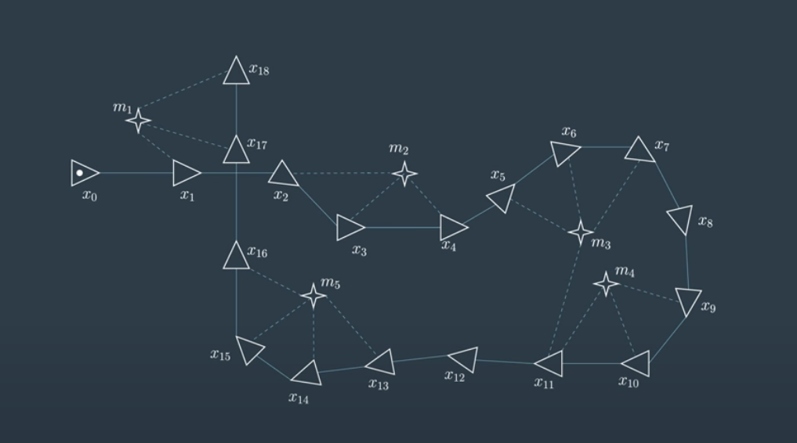
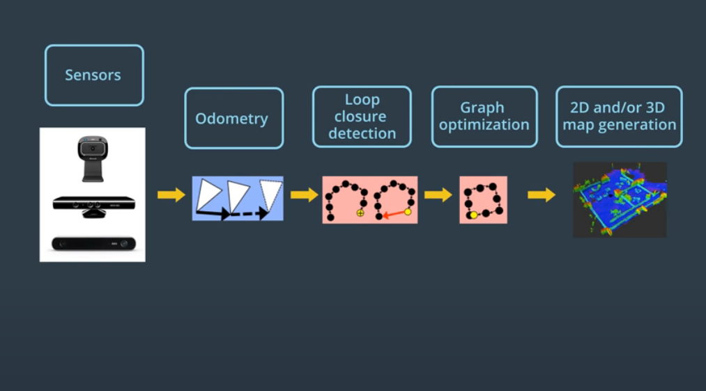
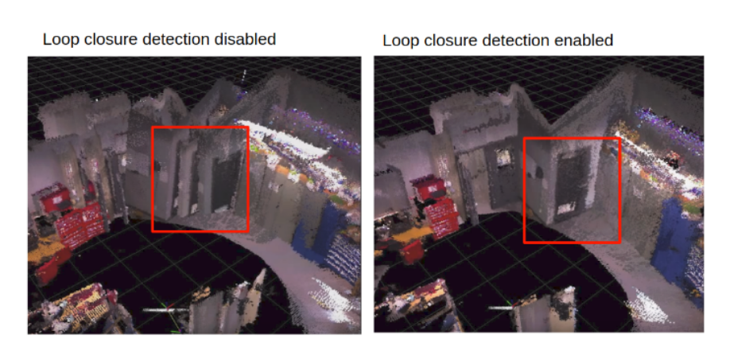
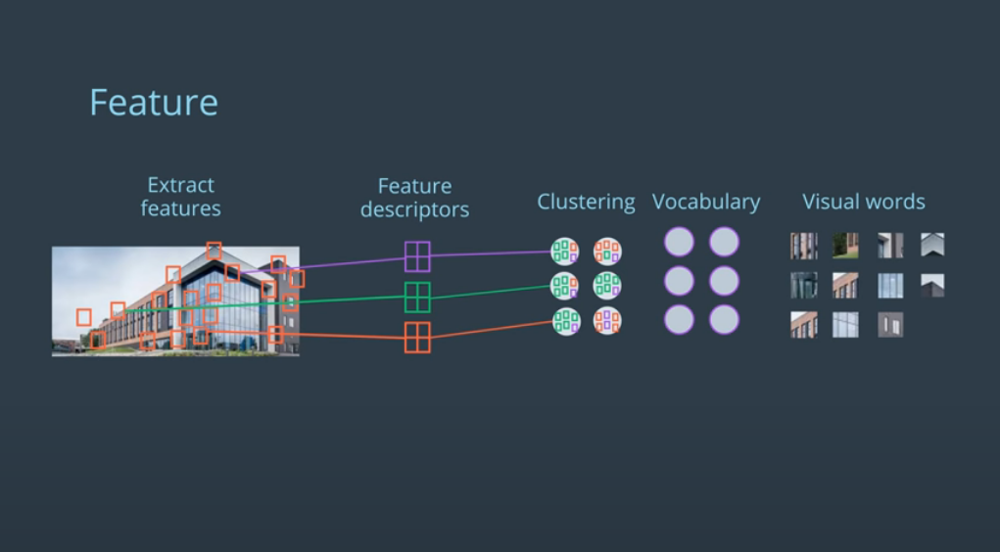
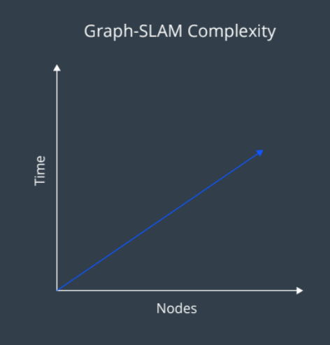
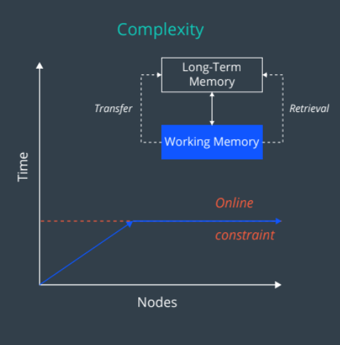

# Grid-based FastSLAM

In this section, the concepts from Grid-Based FastSLAM will be utilized to study and implement GraphSLAM. GraphSLAM imporves on FastSLAM by solving the Full SLAM problem, meaning it solves for all poses and maps up until the current time, not just the current map and pose. 

FastSLAM works with finite data and finite particles, so there is room for error. GraphSLAM uses all data from past and present to solve the SLAM problem.

## Front-End

On the front-end of GraphSLAM, is the creation of what is known as __Graphs__. Graphs show robot poses and features in the environment throughout time. Connecting consecutive poses are __motion constraints__ which are calculated from measurments like odometry and their errors. Connecting poses with features are __measurement constraints__ which are calculated from measurements like Lidar and their errors. Graphs use the following notation:

* __Poses__ = triangles
* __Features__ = stars
* __Motion Constraints__ = solid line
* __Measurement Constraints__ = dashed line

An example of a Graph is shown below:

## Back-End

On the back-end of GraphSLAM, is the optimization of a Graph, using the positions of poses and features and their corresponding constraints. It tries to estimate the most likely configuration given the motion and measurements.

The back-end used __Maximum Likelihood Estimation (MLE)__. MLE is the process of estimating parameters of probability distribution by maximizing the likelihood function. In the case of GraphSLAM, MLE is used to estimate the motion (distance between poses) and measurement (distance between poses and features) parameters given their probability distributions by maximizing likelihood function or minimizing error function. 

A common algorithm for solving this problem is __Gradient Descent__. Gradient descent works by making an initial guess for the minimum of the error function and then moving opposite to the gradient to reach the minimum of the function. Shortcomings of this include arriving at local minimums and not the global minimum so __Stochastic Gradient Descent (SDG)__ can be used which is an iterative method of gradient descent using sub samples of data.

## RTAB Mapping

__Real-Time Apperance-Based Mapping__ is a GraphSLAM approach that uses visual sensors to localize the robot and map the environment. RTAB Mapping takes input from visual sensors and other odometry, performs loop closure detection and graph optimization, and then produces a map of the environment. The general overview of GraphSLAM is shown below:

Two key characteristics of RTAB mapping involve __loop closure detection__ and __memory management__.

### Loop Closure Detection

Loop closure detection is the process of finding matches between past and currently mapped areas. Using visual data and odometry, RTAB mapping performs loop closure detection to detect areas that have already been mapped and update them accordingly using some special techniques. When loop closure is disabled, areas that are seen again from visual sensors are mapping again as new locations and the output looks choppy. When loop closure detection is enabled, a more smooth map is created.

How does loop closure detect similar or already mapping images? Loop closure detection uses a __Bag-of-Words__ model. To detect previous and current matches, features in images are extracted. These features are clustered into similiar-looking feature groups or "words" which define the "vocabulary". Now, when new images are received by visual sensors, they are analyzed to see if they contain any words. All words contained in the images are put into a bag of words that is associated with the image. That way, bags of words of different images can be compared to determine similarity.

### Graph Optimization and Memory Management

General GraphSLAM complexity increases linearily forever as the number of nodes increase. RTAB mapping applies memory management techniques to allow for real-time map assembly by limiting complexity. RTAB mapping only performs loop closure detection on images in its working memory. The working memory size is kept constant as images are constantly transferred to long-term memory. As the working memory remains constant, the complexity and time as the number of nodes increase stays the same. This is illustrate below.

  