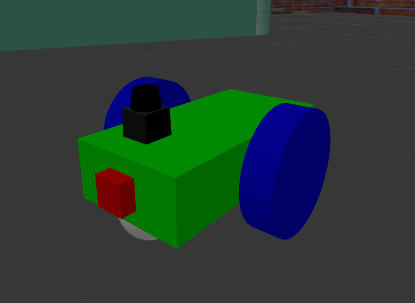
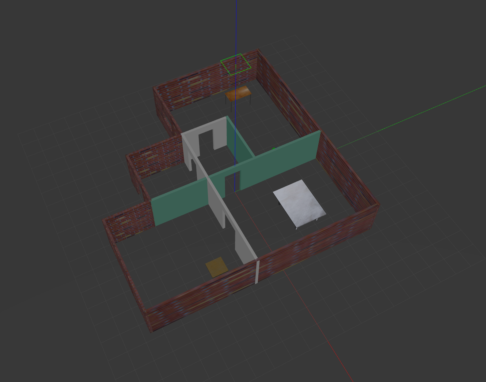
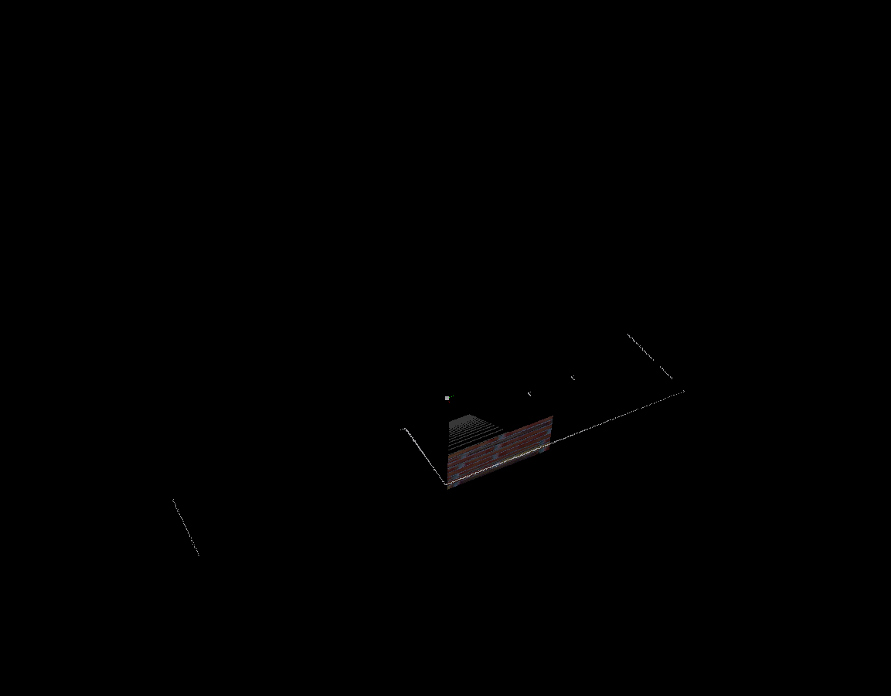
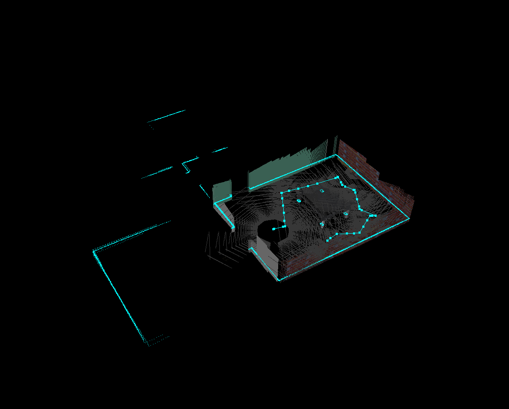
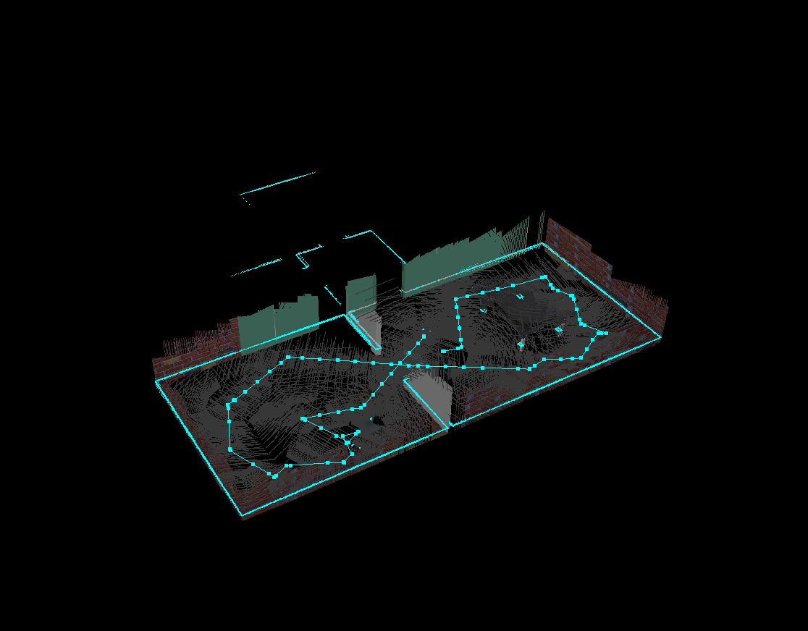
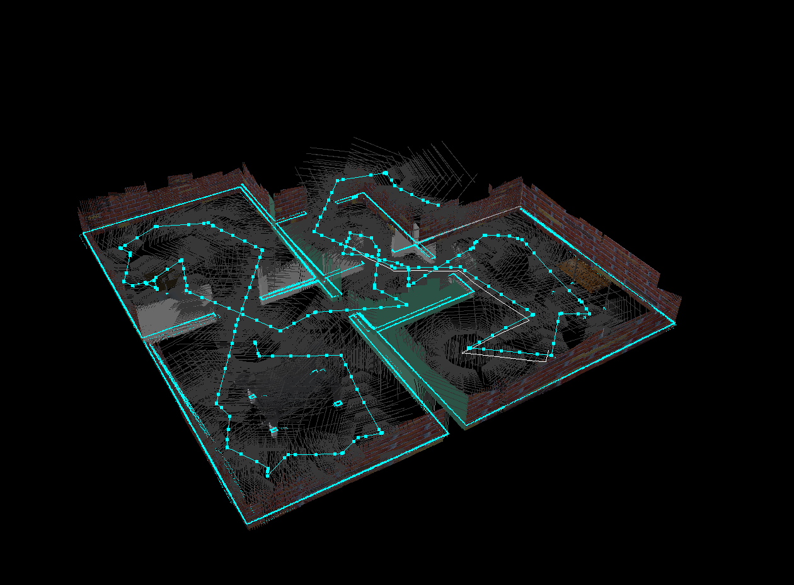

# Map My World - Final Project


In this final unit project, the knowledge learned in the previous sections about mapping and SLAM is applied to implement mapping of an unknown environment using a custom robot. As learned earlier, Real-Time Appearance-Based (RTAB) mapping uses a visual camera to map the surrounding environment, and uses techniques like loop closure detection and memory management and map optimization to produce the most likely map in real time.

The __slam_project__ ROS package includes all launch files for mapping, the world, and the robot as well as robot description files.

## Robot

The robot created is the custom made robot used in previous projects with added sensors. The robot includes a visual RGBD camera to implement the RTAB mapping along with a hokuyo laser mounted on the top to aid in the mapping process.



## World

The world used in this project was a very simple, custom-built world used for previous projects. This world will be mapped in the Gazebo simulator by the robot using RTAB mapping.



To view the world and robot in Gazebo, make sure you install and build the slam_project ROS package in your catkin_ws, source the workspace, and then run:

```
$ roslaunch slam_project world.launch
```

## Implementation

First make sure you have the openni, rtabmap, and teleop key ROS packages installed:

```
$ sudo apt-get install ros-melodic-key-teleop
$ sudo apt-get install ros-melodic-openni*
$ sudo apt-get install ros-melodic-rtabmap-ros
```

To run this project, clone the repo and copy the slam_project ROS package into your local catkin workspace and build and source it.

To open the Gazebo simulator with the world and robot:

```
$ roslaunch slam_project world.launch
```

To start the mapping and open the RTAB mapping GUI:
```
$ roslaunch slam_project mapping.launch
```

To start moving the robot around and begin the mapping process:
```
$ rosrun key_teleop key_teleop.py key_vel:=cmd_vel
```

Now as you control the robot in Gazebo with the keyboard, you should be able to see the current map update in the RTAB mapping GUI, along with real-time loop closure detection. As you move around more in the environment, the map will continue to fill out and get better as the robot receives data from the camera and laser and updates the map accordingly.




