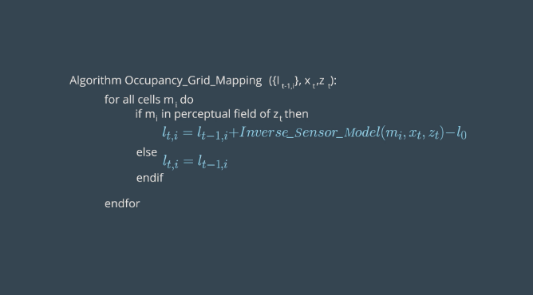

# Occupancy Grid Mapping

This section involves the process of creating a map of an environment using the Occupany Grid Mapping algorithm.

Mapping allows for the successful and safe movement of mobile robots in an unknown and dynamic environment. We will
first start with mapping with __known__ poses and then move to the more difficult problem of SLAM later which
performs mapping with __unknown__ poses.

Problems with mapping include:

* Large hypothesis space
* Noise
* Positional ambiguity

## Mapping with known poses

The above image represents this problem of mapping with known poses along with the posterior probability function. The
posterior over the map is calculated given the measurements and poses up until time t.

The Occupancy Grid Mapping algorithm estimates the map by divided it into a finite number of equally sized grid cells.
These cells will either have values of 1 or 0 depending on if that space it represented is occupied or free respectively.

### Binary Bayes Filter

The Occupany Grid Mapping algorithm uses the Binary Bayes Filter to compute the posterior belief using
previous beliefs and current measurements. The summary of the filter is shown below.

## Occupancy Grid Mapping Algorithm

This algorithm uses the Binary Bayes Filter to estimate the occupancy values of grid cells. The algorithm takes the 
previous belief, current poses, and current measurements as input. The algorithm loops through all of the grid cells
in the map. If a grid cell is within range of a sensor, the occupancy value of the cell is updated using the Binary
Bayes Filter. If not, the occupany value remains the same. This is summarized below.

Remember that a part of the Binary Bayes Filter is the Inverse Sensor Model which estimates the probability of the map
given the measurements and the poses in its log odds representation. This algorithm is illustrated below.

The variables are defined as:

* mi = map at instant i
* xi, yi = centre of mass of the cell mi
* r = range of centre of mass
* k = rangefinder cone
* B = opening angle of measurement beam
* a = width of a cell

The algorithm has 3 different behaviors depending on 3 cases:

1. If the cell mi is outside of the range of the measurement cone, the previous state is returned.
2. If the cell is within +/- a/2 of a detected range, the cell is considered occupied.
3. If the cell range is less than a/2 of the detected range, the cell is considereed free.

## Implementation

Now we can implement mapping using the Occupancy Grid Mapping Algorithm. This solution will use sample
data (measurements and poses) to estimate the map. An image of the map will then be generated using
the matplotlib library. Follow the steps below. 

Clone the repository:

`$ git clone https://github.com/grejj/RoboticsND-Map-My-World.git`
`$ cd RoboticsND-Map-My-World`

Clear any past maps but not the folder itself:

`$ rm -rf Maps/*`

Compile the program:

`$ g++ main.cpp -o app -std=c++11 -I/usr/include/python2.7 -lpython2.7`

Run the program:

`$ ./app`

The program will then generate a map in the Maps directory as shown below.

